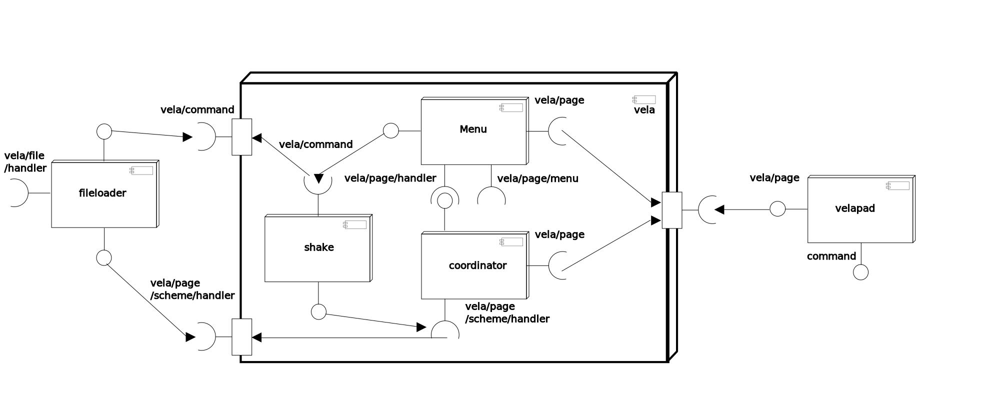

Vela
======

Vela library is a browser like feature for roopkotha. It handles augmented contents and it routes the menu actions to something appropriate.

Dependencies
============

You need to get the following project sources,

- [aroop](https://github.com/kamanashisroy/aroop)
- [shotodol](https://github.com/kamanashisroy/shotodol)
- [shotodol\_script](https://github.com/kamanashisroy/shotodol_script)
- [shotodol\_media](https://github.com/kamanashisroy/shotodol_media)
- [roopkotha](https://github.com/kamanashisroy/roopkotha)

Modules
========

- [doc](libs/doc)
- [vela](libs/vela)
	- [richml](libs/vela/richml)
	- [divml](libs/vela/divml)
	- [rower](libs/vela/rower)
	- [handler](libs/vela/handler)
	- [menu](libs/vela/menu)

Applications
============
- [fileloader](guiapps/fileloader)
- [historycommands](guiapps/historycommands)
- [velapad](guiapps/velapad)
- [velashake](guiapps/velashake)

Architecture
============

Tasks
======

[Tasks](TASKS.md)

